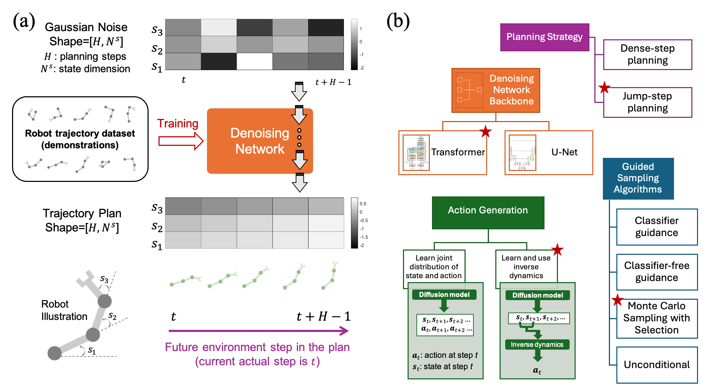

# What Makes a Good Diffusion Planner for Decision Making?

<p align="center">
·
<a href="https://openreview.net/pdf?id=7BQkXXM8Fy">Paper</a>
·
<a href="#">Code</a>
·
<a href="https://openreview.net/forum?id=7BQkXXM8Fy">OpenReview</a>
</p>

This repository contains the PyTorch implementation of *"What Makes a Good Diffusion Planner for Decision Making?"* (ICLR 2025, Spotlight)

<p align="center">
    <br>
    
    <br>
<p>

# 🛠️ Setup
Let's start with python 3.9. It's recommend to create a `conda` env:

## Create a new conda environment 
```shell
conda create -n dv python=3.9 mesalib glew glfw pip=23 setuptools=63.2.0 wheel=0.38.4 protobuf=3.20 -c conda-forge -y
conda activate dv
```

## Install for MuJoCo Simulator and mujoco-py (Important)
Install mujoco following the instruction [here](https://github.com/openai/mujoco-py#install-mujoco).

Alternatively, run the following script for a quick setup:
```shell
#!/bin/bash
sudo apt-get update && sudo apt-get install -y wget tar libosmesa6-dev libgl1-mesa-glx libglfw3 patchelf cmake
sudo ln -s /usr/lib/x86_64-linux-gnu/libGL.so.1 /usr/lib/x86_64-linux-gnu/libGL.so
echo $USER_DIR
wget -c "https://mujoco.org/download/mujoco210-linux-x86_64.tar.gz"
mkdir -p /home/$USER_DIR/.mujoco
cp mujoco210-linux-x86_64.tar.gz /home/$USER_DIR/mujoco.tar.gz
rm mujoco210-linux-x86_64.tar.gz
mkdir -p /home/$USER_DIR/.mujoco
tar -zxvf /home/$USER_DIR/mujoco.tar.gz -C /home/$USER_DIR/.mujoco
echo "export LD_LIBRARY_PATH=$LD_LIBRARY_PATH:/home/$USER_DIR/.mujoco/mujoco210/bin" >> ~/.bashrc
echo "export MUJOCO_PY_MUJOCO_PATH=/home/$USER_DIR/.mujoco/mujoco210" >> ~/.bashrc
```

## Install Dependencies
```shell
pip install -r requirements.txt
pip install -e .
```
For PyTorch installation, refer to the official PyTorch setup guide to ensure compatibility with your hardware.


# 💻 Training & Inference
## Run Diffusion Veteran 
We provide a **single script** for easy execution of the training and inference tasksets. You can run the following commands to get started with different environments:
```shell
bash scripts/DV_antmaze_reimp.sh
bash scripts/DV_kitchen_reimp.sh
bash scripts/DV_maze2d_reimp.sh
bash scripts/DV_mujoco_reimp.sh
```

## Try Different Configurations
To experiment with different configurations, simply modify the settings in scripts_templates/train_template.sh. This file allows you to easily adjust parameters for your experiments. Once you’ve updated the configuration, run the following script:
```shell
bash scripts_templates/template.sh
```
This provides flexibility for trying different setups without needing to manually edit each script.

# 🏷️ Acknowledgements
This code is built upon [CleanDiffuser](https://github.com/CleanDiffuserTeam/CleanDiffuser), following their coding standards. You are welcome to conduct unified ablation studies or standardized comparisons with the baselines in CleanDiffuser. Please see the [license](LICENSE) for further details. 

# 📝 Citation
If you find our work useful in your research, please consider citing:
```
@inproceedings{
lu2025what,
title={What Makes a Good Diffusion Planner for Decision Making?},
author={Haofei Lu and Dongqi Han and Yifei Shen and Dongsheng Li},
booktitle={The Thirteenth International Conference on Learning Representations},
year={2025},
url={https://openreview.net/forum?id=7BQkXXM8Fy}
}
```